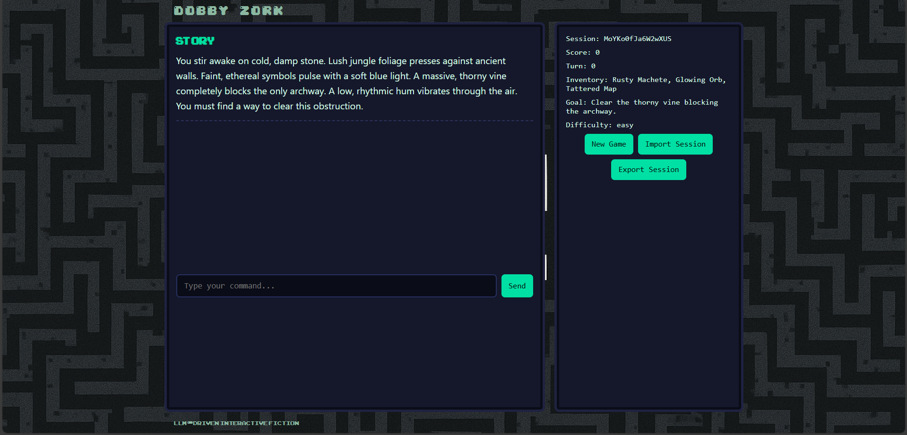

# Dobby Zork
Dobby Zork is a modern reimagining of the classic Zork adventure game, powered by the Dobby LLM model (Fireworks API). Instead of relying on pre-written text, it dynamically generates unique storylines, puzzles, and interactions for each player, creating a personalized adventure every time. The LLM not only crafts the narrative and dialogue but also verifies the player’s actions and decisions, ensuring they make logical sense within the game world. This blend of AI storytelling and interactive gameplay makes Dobby Zork a living, evolving version of Zork where no two journeys through the digital underground are ever the same.
## DEMO


## Structure

```
dobby-zork/
├─ public/
│  ├─ pixel-font.woff2
│  └─ favicon.ico
├─ src/
│  ├─ client/
│  │  ├─ index.html
│  │  ├─ main.jsx
│  │  ├─ App.jsx
│  │  ├─ components/
│  │  │  ├─ PixelWindow.jsx
│  │  │  ├─ InputBar.jsx
│  │  │  └─ SessionControls.jsx
│  │  └─ styles.css
│  ├─ worker/
│  │  ├─ index.mjs
│  │  ├─ handlers.mjs
│  │  └─ llm/
│  │     ├─ adapter.mjs
│  │     ├─ geminiAdapter.mjs
│  │     ├─ fireworksAdapter.mjs
│  │     └─ stubAdapter.mjs
├─ package.json
├─ wrangler.toml
├─ .env.example
└─ README.md
```

## API Endpoints

- `POST /api/new` — create session; calls INIT_PROMPT and returns `{ sessionId, scene, metadata }`.
- `POST /api/act` — body `{ sessionId, input }`; validates/sanitizes input; rate-limits; calls JUDGE_PROMPT; updates session; returns `{ newScene, feedback, score, ended }`.
- `POST /api/session/save` — save snapshot to KV or in-memory.
- `GET /api/session/:id` — retrieve snapshot.
- CORS enabled for static client.

## LLM Prompts & Roles

- `src/worker/llm/promptTemplates.mjs` defines `INIT_PROMPT(seed)` and `JUDGE_PROMPT(history, lastScene, userInput, storyGuidelines)`.
- Server sends system instruction: "You are a retro-text-adventure game master. Always return JSON only (no extra commentary)." and includes JSON schemas.

## Adapter Selection

- `src/worker/llm/adapter.mjs` auto-selects Fireworks or Gemini based on env (`FIREWORKS_API_KEY`, `GEMINI_API_KEY`), else uses `stubAdapter`. Checks both Worker `env` and Node `process.env` for compatibility.
- Adapters return `{ text, json, usage?: { tokens } }`.

## Security & Limits

- Input sanitized (control chars stripped, 2000 char limit).
- Rate limit: 1 req/sec and 60/min per session.
- User input wrapped in JSON for prompts; API keys never logged.

## Frontend Behavior

- On first load, POST `/api/new`; persist `sessionId` in `localStorage` and cookie; render pixel UI (terminal window, inventory/stats, input bar).
- Submit commands with Enter; update local snapshot each step; export session JSON.
- Offline demo fallback: if Worker unreachable, client uses stub to continue a canned story.

## Deploy

### Cloudflare Workers

1. Install wrangler; set up KV namespace and bind as `SESSIONS_KV`.
2. Publish:

```
wrangler publish
```

### Cloudflare Pages / Functions

- Place static client in `public/`; Workers code in `src/worker/` as module entry.

## Environment Variables

Set environment via wrangler secrets or Pages project variables:

- `FIREWORKS_API_KEY` — enables Fireworks adapter (For Dobby Model)
- `GEMINI_API_KEY` — enables Gemini adapter (For Gemini Model)
- `SESSIONS_KV_NAMESPACE` — optional KV namespace id (bind as `SESSIONS_KV`)

## Example cURL

Create a session:

```
curl -X POST https://your-worker.example/api/new
```

Submit an action:

```
curl -X POST https://your-worker.example/api/act \
  -H 'content-type: application/json' \
  -d '{"sessionId":"<id>","input":"look"}'
```

## Replace Adapters With Real SDK/API

- In `src/worker/llm/geminiAdapter.mjs`, replace the `endpoint` with the official Gemini REST URL and adjust the request body, then parse the JSON-only response returned by your prompt. Look for the comment: REPLACE with your Gemini endpoint here.
- In `src/worker/llm/fireworksAdapter.mjs`, ensure the `model` and `endpoint` match your account; the current shape uses chat completions. Always parse `message.content` as JSON per the prompt instruction.
- Maintain the return shape: `{ text, json, usage }`.

## Build Zip

```
npm run zip
```

Creates `dobby-zork.zip` containing `src/`, `public/`, `package.json`, `wrangler.toml`.

## Tests

- `npm run test:new` → simulates `POST /api/new` and asserts shape
- `npm run test:act` → simulates `POST /api/act` and asserts shape

## 🧩 TODO
- [ ]  🌍 Add multi-language support